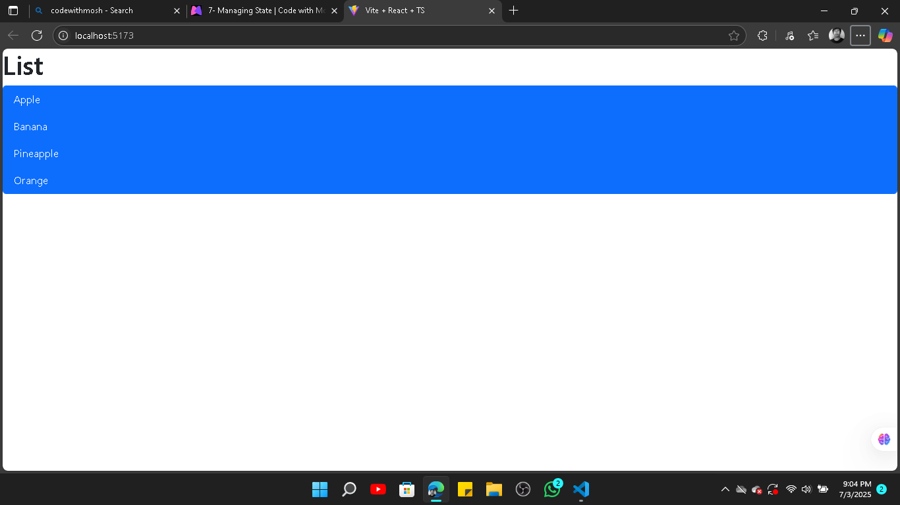

## JavaScript
[Video tutorial](https://youtu.be/lfmg-EJ8gm4)

**I know the basics (Data type variable stuff)**

[SKipped to 45 mins](https://youtu.be/lfmg-EJ8gm4?t=2693)

**Project :** Counter

```JS
const decreaseBtn = document.getElementById("decreaseBtn");
const resetBtn = document.getElementById("resetBtn");
const increaseBtn = document.getElementById("increaseBtn");
const countLabel = document.getElementById("countLabel");
let count = 0;

increaseBtn.onclick = function(){
    count++;
    countLabel.textContent = count;
}

decreaseBtn.onclick = function(){
    count--;
    countLabel.textContent = count;
}

resetBtn.onclick = function(){
    count = 0;
    countLabel.textContent = count;
}
```
Built-in object that provides a collection 
of properties and methods

## Math objects
```JS

let x = 3;
let y = 2;
let z = 1;

z = Math.round(x);
z = Math.floor(x);
z = Math.ceil(x);
z = Math.trunc(x);
z = Math.pow(x, y);
z = Math.sqrt(x);
z = Math.log(x);
z = Math.sin(x);
z = Math.cos(x);
z = Math.tan(x);
z = Math.abs(x);
z = Math.sign(x);
```

**Project :** Random Number Generator:

```JS
<!DOCTYPE html>
<html lang="en">
<head>
    <meta charset="UTF-8">
    <meta name="viewport" content="width=device-width, initial-scale=1.0">
    <title>My website</title>
    <link rel="stylesheet" href="style.css">
</head>
<body>
    <button id="myButton">roll</button><br>
    <label id="label1" class="my"></label><br>
    <label id="label2"></label><br>
    <label id="label3"></label><br>
    <script src="index.js"></script>
</body>
</html>


const myButton = document.getElementById("myButton");
const label1 = document.getElementById("label1");
const label2 = document.getElementById("label2");
const label3 = document.getElementById("label3");
const min = 1;
const max = 6;
let randomNum1;
let randomNum2;
let randomNum3;

myButton.onclick = function() {
    randomNum1 = Math.floor(Math.random() * max) + min;
    randomNum2 = Math.floor(Math.random() * max) + min;
    randomNum3 = Math.floor(Math.random() * max) + min;
    label1.textContent = randomNum1;
    label2.textContent = randomNum2;
    label3.textContent = randomNum3; 
}
```  
## Checked
[Video](https://youtu.be/SgxzJdqhyfw?list=PLZPZq0r_RZOO1zkgO4bIdfuLpizCeHYKv)

```js
<!DOCTYPE html>
<html lang="en">
<head>
    <meta charset="UTF-8">
    <meta name="viewport" content="width=device-width, initial-scale=1.0">
    <title>Document</title>
</head>
<body>
    <input name="payment" type="radio" id="Bkash"><label for="Bkash">Bkash</label><br>
    <input name="payment" type="radio" id="Nagad"><label for="Nagad">Nagad</label><br>
    <input name="payment" type="radio" id="COD"><label for="COD">Cash on delivery</label><br>

    <br>
    <input type="submit" name="submit" id="submit">

    <p id="text"></p>
    <script>
        let bkash = document.getElementById("Bkash");
        let nagad = document.getElementById("Nagad");
        let cod = document.getElementById("COD");
        let text = document.getElementById("text");

document.getElementById("submit").onclick = function() {
        if (bkash.checked) {
        text.textContent = "You're paying with Bkash";
        } else if (nagad.checked) {
            text.textContent = "You're paying with Nagad";
        } else if (cod.checked) {
           text.textContent = "You're paying with COD";
        } else {
        text.textContent = "Please select a payment method";
        }
    }
    </script>
</body>
</html>
```
## Ternary operator

*conditin ? if_true : if_false ;*

```js
let age = 12;
let messege = age >= 18 ? "Adult" : "Minor";

console.log(messege);
```
## switch statement
switch is like a multiple choice question for your code.
It checks the value of a variable, and runs the matching case.

**Format**

```js
switch(variable) {
  case value1:
    // do something
    break;
  case value2:
    // do something else
    break;
  default:
    // if nothing matches
}
```
**Example**

```js
    var day = 2;

    switch(day){
        case 1:
            console.log("It's Saturday");
            break;
        case 2:
            console.log("It's Sunday");
            break;
        case 3:
            console.log("It's Monday");
            break;
        case 4:
            console.log("It's Tuesday");
            break;
        case 5:
            console.log("It's Wdnesday");
            break;
        case 6:
            console.log("It's Thursday");
            break;
        case 7:
            console.log("It's Friday");
            break;
        default:
            console.log("Invalid day!");
    }
```