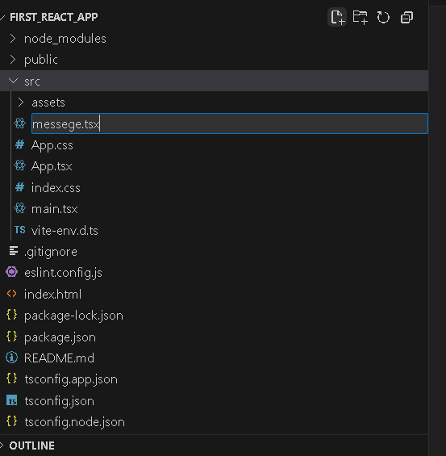

# React JS
**By Mosh Hamedani**
[Repo : The codes used in this course](https://github.com/mosh-hamedani/react-course-part1)

**Prerequisites**
- HTML
- CSS 
- jS
- Typescript (Optional)

## Environment setup (VS code)
Gotta install nodeJS version 16+


after installing , check


> `Prettier` vscode extention is recommended. (Settngs > Enable `Format on save`)

## What's react ?

React is a JavaScript library that helps you build user interfaces, especially the front-end of web apps. Instead of messing with `document.createElement` or a bunch of DOM code, React lets you build stuff using components—small, reusable pieces of code that return HTML-looking syntax called JSX. It updates the UI automatically when data changes, so you don’t have to manually control what changes where. Basically, it makes your web apps faster, cleaner, and way easier to manage once things get big.

## First react app
There are two tools for it
- Create react app (CRA)
- Vite
We're gonna use vite.
**Start**
* Open **CMD** and navigate to the folder where you want your project:

  ```bash
  cd "C:\Users\YourName\Path\To\Folder"
  ```

* Run the Vite project setup command:

  ```bash
  npm create vite@latest
  ```

* When prompted:

  * 📦 Enter a **project name** (e.g., `first_react_app`)
  * ⚛️ Select **React** as the framework
  * 🟦 Choose **TypeScript** or **JavaScript** (you picked TypeScript)

* Once done, navigate into your new project folder:

  ```bash
  cd first_react_app
  ```

* Install the dependencies:

  ```bash
  npm install
  ```

* Start the dev server:

  ```bash
  npm run dev
  ```

* ✅ Your app will be live on something like `http://localhost:5173`


**This is what the folder looks like with the installed packeges**


Now go touch grass after seeing that sweet React welcome screen 🌱

## Create a react component
Extension : .ts (Used for typscript) , **.tsx (Used for typescript based react components)**

1. first , open a new .tsx file in the src folder


2. The `app.tsx` is the main folder 

3. Write some code in the `messege.tsx` file. (Testing)

**We're making a function based component**
```js
// Defining a functional React component named Messege
function Messege(){
    // JSX (JavaScript XML): This lets us write HTML-like syntax in JS
    return <h1>Hello world</h1>; // Renders an <h1> element with "Hello world"
}

// Exporting the Messege component as the default export from this file
export default Messege;
```

4. Import `Messege` to `App.tsx`;

**App.tsx**
```tsx
import Messege from "./messege";

function App() {
    return <div><Messege/></div>
}

export default App; // So , it can be used somewhere else.
```

5. Run it like this

  * Go to terminal (powershell)
  * Locate the file (cd filepath)
  * type `Set-ExecutionPolicy -Scope Process -ExecutionPolicy Bypas'`
    > just for this terminal session, don’t block script files. Let me run what I want (like npm.ps1). I’m grown.”
  * then type `npm run dev`
  * Follow the `localhost` link


## How does react work 
<video width="600" controls>
  <source src="Images/JS/React/How react works.mp4" type="video/mp4">
</video>
